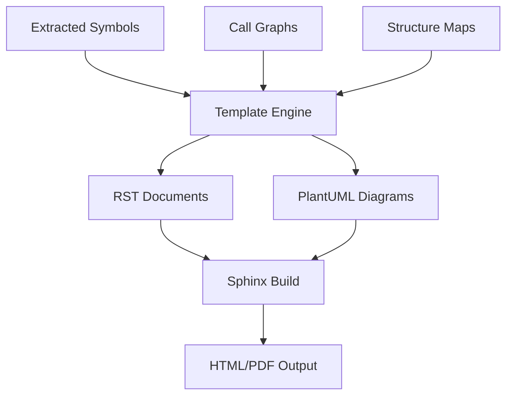
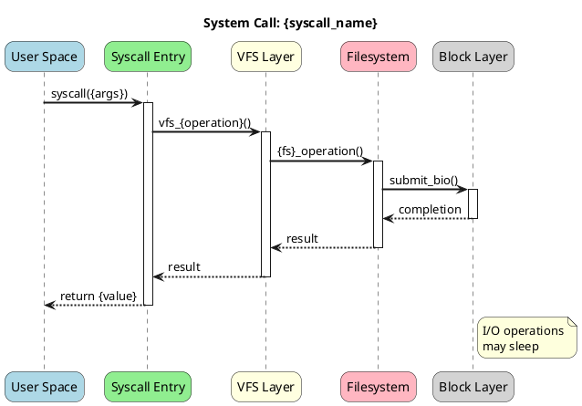
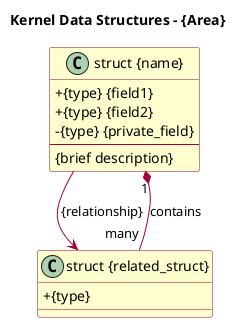
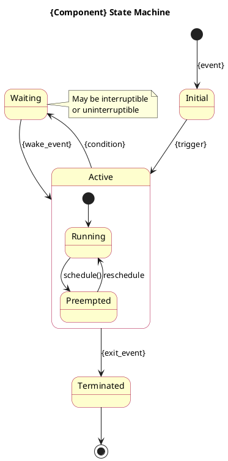

# Linux Kernel Architecture Documentation Extraction Plan

## Executive Summary

This document outlines a comprehensive methodology for extracting, documenting, and presenting the Linux kernel's architecture. The plan covers analysis techniques, documentation formats, and provides executable scripts for automated extraction of architectural insights.

---

## Table of Contents

1. [Objectives](#objectives)
2. [Scope and Subsystems](#scope-and-subsystems)
3. [Extraction Methodology](#extraction-methodology)
4. [Documentation Framework](#documentation-framework)
5. [UML Diagrams Specification](#uml-diagrams-specification)
6. [Scripts and Tools](#scripts-and-tools)
7. [Output Structure](#output-structure)
8. [Workflow and Timeline](#workflow-and-timeline)
9. [Quality Assurance](#quality-assurance)
10. [Usage Examples](#usage-examples)

---

## 1. Objectives

### Primary Goals

| Goal | Description | Success Criteria |
|------|-------------|------------------|
| **Architecture Extraction** | Reverse-engineer kernel subsystem architectures | Complete component mapping for all major subsystems |
| **Documentation Generation** | Create comprehensive technical documentation | RST-compatible docs with PlantUML diagrams |
| **Code Examples** | Provide runnable examples for each concept | All examples compile and execute correctly |
| **Relationship Mapping** | Document inter-subsystem dependencies | Complete dependency graph with call flows |

### Secondary Goals

- Enable kernel newcomers to understand architecture quickly
- Provide reference material for kernel developers
- Create reusable extraction scripts for ongoing documentation

---

## 2. Scope and Subsystems

### Priority 1: Core Subsystems

```
┌─────────────────────────────────────────────────────────────────────┐
│                        CORE KERNEL SUBSYSTEMS                        │
├─────────────────┬─────────────────┬─────────────────┬───────────────┤
│   Process Mgmt  │  Memory Mgmt    │  File Systems   │  Networking   │
│   kernel/sched/ │  mm/            │  fs/            │  net/         │
│   kernel/fork.c │  mm/page_alloc  │  fs/vfs         │  net/socket.c │
│   kernel/exit.c │  mm/vmalloc     │  fs/namei.c     │  net/core/    │
│   kernel/signal │  mm/slab        │  fs/file_table  │  net/ipv4/    │
└─────────────────┴─────────────────┴─────────────────┴───────────────┘
```

### Priority 2: Infrastructure Subsystems

| Subsystem | Path | Key Components |
|-----------|------|----------------|
| **Block I/O** | `block/` | Request queue, BIO, I/O schedulers |
| **Device Drivers** | `drivers/` | Driver model, device trees |
| **Security** | `security/` | LSM framework, SELinux, capabilities |
| **IRQ/Interrupts** | `kernel/irq/` | Interrupt handling, softirqs |
| **Locking** | `kernel/locking/` | Spinlocks, mutexes, RCU |

### Priority 3: Architecture-Specific

| Architecture | Path | Focus Areas |
|--------------|------|-------------|
| **x86_64** | `arch/x86/` | Boot, paging, syscalls |
| **ARM64** | `arch/arm64/` | Exception handling, memory model |
| **RISC-V** | `arch/riscv/` | SBI interface, extensions |

---

## 3. Extraction Methodology

### Phase 1: Static Analysis

```
┌─────────────────────────────────────────────────────────────────────┐
│                      STATIC ANALYSIS PIPELINE                        │
├─────────────────────────────────────────────────────────────────────┤
│                                                                      │
│  ┌──────────────┐   ┌──────────────┐   ┌──────────────┐             │
│  │  Source Code │ → │ Symbol       │ → │ Structure    │             │
│  │  Parsing     │   │ Extraction   │   │ Analysis     │             │
│  └──────────────┘   └──────────────┘   └──────────────┘             │
│         │                  │                  │                      │
│         ▼                  ▼                  ▼                      │
│  ┌──────────────┐   ┌──────────────┐   ┌──────────────┐             │
│  │ Function     │   │ Data         │   │ Dependency   │             │
│  │ Call Graphs  │   │ Structures   │   │ Graphs       │             │
│  └──────────────┘   └──────────────┘   └──────────────┘             │
│                                                                      │
└─────────────────────────────────────────────────────────────────────┘
```

#### Analysis Steps

1. **Symbol Extraction**
   - Extract function signatures using `ctags` or `cscope`
   - Parse struct definitions from headers
   - Identify exported symbols via `EXPORT_SYMBOL*`

2. **Call Graph Generation**
   - Generate function call graphs using `cflow` or `egypt`
   - Identify critical paths and hot functions
   - Map syscall entry points to implementation

3. **Structure Relationship Mapping**
   - Extract struct member pointers
   - Build entity-relationship diagrams
   - Document container_of() usage patterns

### Phase 2: Dynamic Analysis (Optional)

| Tool | Purpose | Output |
|------|---------|--------|
| `ftrace` | Function tracing | Call sequences, timing |
| `perf` | Performance analysis | Hot paths, bottlenecks |
| `eBPF` | Custom probes | Specific flow analysis |

### Phase 3: Documentation Generation



---

## 4. Documentation Framework

### Document Types

#### 4.1 Architecture Overview Document

```
docs/architecture/{subsystem}/
├── overview.rst              # High-level architecture
├── components.rst            # Component breakdown
├── data-structures.rst       # Key structures
├── api-reference.rst         # Public API docs
├── internals.rst             # Internal implementation
└── examples/                 # Code examples
    ├── basic-usage.c
    ├── advanced-patterns.c
    └── error-handling.c
```

#### 4.2 Template: Overview Document

```rst
{Subsystem Name} Architecture
=============================

.. contents:: Table of Contents
   :depth: 3
   :local:

Overview
--------

Brief description of the subsystem's purpose and role in the kernel.

Architecture Diagram
--------------------

.. uml::

   @startuml
   !include C4_Container.puml
   ... diagram content ...
   @enduml

Key Components
--------------

.. list-table:: Components
   :header-rows: 1
   
   * - Component
     - File Location
     - Description
   * - {name}
     - {path}
     - {description}

Data Flow
---------

Description of how data flows through the subsystem.

API Summary
-----------

.. kernel-doc:: path/to/source.c
   :functions: function_name

Examples
--------

.. literalinclude:: examples/basic-usage.c
   :language: c
   :linenos:
```

---

## 5. UML Diagrams Specification

### 5.1 C4 Model Diagrams

#### Container Diagram Template

```plantuml
@startuml C4_Container_Template
!include https://raw.githubusercontent.com/plantuml-stdlib/C4-PlantUML/master/C4_Container.puml

title Linux Kernel - {Subsystem Name} Container View

LAYOUT_WITH_LEGEND()

Person(dev, "Kernel Developer", "Develops/maintains kernel code")

System_Boundary(kernel, "Linux Kernel") {
    Container(subsys, "{Subsystem}", "C", "{Description}")
    Container(dep1, "{Dependency 1}", "C", "{Description}")
    Container(dep2, "{Dependency 2}", "C", "{Description}")
    
    ContainerDb(ds, "{Data Structures}", "struct", "{Key structures}")
}

System_Ext(hw, "Hardware", "{Hardware layer}")
System_Ext(user, "User Space", "Applications")

Rel(dev, subsys, "Develops")
Rel(user, subsys, "Uses via syscalls")
Rel(subsys, dep1, "Calls")
Rel(subsys, hw, "Interacts with")
@enduml
```

#### Component Diagram Template

```plantuml
@startuml C4_Component_Template
!include https://raw.githubusercontent.com/plantuml-stdlib/C4-PlantUML/master/C4_Component.puml

title {Module Name} - Component View

Container_Boundary(module, "{Module}") {
    Component(init, "Initialization", "C", "__init functions")
    Component(core, "Core Logic", "C", "Main implementation")
    Component(api, "Public API", "C", "Exported functions")
    Component(internal, "Internal Helpers", "C", "Static functions")
    Component(cleanup, "Cleanup", "C", "__exit functions")
}

Rel(init, core, "Initializes")
Rel(api, core, "Delegates to")
Rel(core, internal, "Uses")
Rel(cleanup, core, "Cleans up")
@enduml
```

### 5.2 Sequence Diagrams

#### Syscall Flow Template



### 5.3 Class/Structure Diagrams

#### Data Structure Template



### 5.4 State Machine Diagrams

#### Process State Template



---

## 6. Scripts and Tools

### Available Scripts

| Script | Purpose | Location |
|--------|---------|----------|
| `extract_symbols.sh` | Extract function/struct symbols | `docs/scripts/` |
| `generate_call_graph.sh` | Generate function call graphs | `docs/scripts/` |
| `extract_structures.py` | Parse and document structs | `docs/scripts/` |
| `generate_diagrams.py` | Auto-generate PlantUML diagrams | `docs/scripts/` |
| `build_docs.sh` | Build final documentation | `docs/scripts/` |
| `analyze_subsystem.sh` | Complete subsystem analysis | `docs/scripts/` |

### Script Usage Overview

```bash
# Full subsystem analysis
./docs/scripts/analyze_subsystem.sh mm

# Extract symbols only
./docs/scripts/extract_symbols.sh kernel/sched/

# Generate diagrams for a specific file
./docs/scripts/generate_diagrams.py --input kernel/fork.c --output docs/diagrams/

# Build final documentation
./docs/scripts/build_docs.sh
```

---

## 7. Output Structure

### Final Documentation Layout

```
docs/
├── architecture-extraction-plan.md    # This document
├── scripts/                           # Extraction scripts
│   ├── extract_symbols.sh
│   ├── generate_call_graph.sh
│   ├── extract_structures.py
│   ├── generate_diagrams.py
│   ├── build_docs.sh
│   ├── analyze_subsystem.sh
│   └── lib/                           # Shared libraries
│       ├── common.sh
│       └── parser_utils.py
├── architecture/                      # Generated architecture docs
│   ├── index.rst
│   ├── process-management/
│   │   ├── overview.rst
│   │   ├── scheduler.rst
│   │   ├── fork.rst
│   │   └── diagrams/
│   ├── memory-management/
│   │   ├── overview.rst
│   │   ├── page-allocator.rst
│   │   ├── slab.rst
│   │   └── diagrams/
│   ├── filesystems/
│   │   ├── overview.rst
│   │   ├── vfs.rst
│   │   └── diagrams/
│   └── networking/
│       ├── overview.rst
│       ├── socket-layer.rst
│       └── diagrams/
├── diagrams/                          # All PlantUML source files
│   ├── c4/
│   ├── sequence/
│   ├── class/
│   └── state/
├── examples/                          # Code examples
│   ├── process/
│   ├── memory/
│   ├── filesystem/
│   └── network/
└── build/                             # Generated output
    ├── html/
    └── pdf/
```

---

## 8. Workflow and Timeline

### Extraction Workflow

```
┌─────────────────────────────────────────────────────────────────────┐
│                     ARCHITECTURE EXTRACTION WORKFLOW                 │
├─────────────────────────────────────────────────────────────────────┤
│                                                                      │
│  Week 1-2: Setup & Core Infrastructure                              │
│  ├── Configure extraction tools                                     │
│  ├── Create script framework                                        │
│  └── Establish documentation templates                              │
│                                                                      │
│  Week 3-4: Process Management                                       │
│  ├── Extract scheduler architecture                                 │
│  ├── Document task lifecycle                                        │
│  └── Generate process state diagrams                                │
│                                                                      │
│  Week 5-6: Memory Management                                        │
│  ├── Extract page allocator architecture                            │
│  ├── Document slab/slub allocators                                  │
│  └── Generate memory flow diagrams                                  │
│                                                                      │
│  Week 7-8: File Systems                                             │
│  ├── Extract VFS architecture                                       │
│  ├── Document file operations flow                                  │
│  └── Generate I/O path diagrams                                     │
│                                                                      │
│  Week 9-10: Networking                                              │
│  ├── Extract socket layer architecture                              │
│  ├── Document packet flow                                           │
│  └── Generate network stack diagrams                                │
│                                                                      │
│  Week 11-12: Integration & Review                                   │
│  ├── Cross-reference all documentation                              │
│  ├── Validate diagrams and examples                                 │
│  └── Generate final output                                          │
│                                                                      │
└─────────────────────────────────────────────────────────────────────┘
```

### Milestone Deliverables

| Milestone | Deliverable | Format |
|-----------|-------------|--------|
| M1 | Script framework complete | Shell/Python scripts |
| M2 | Process mgmt docs | RST + PlantUML |
| M3 | Memory mgmt docs | RST + PlantUML |
| M4 | Filesystem docs | RST + PlantUML |
| M5 | Networking docs | RST + PlantUML |
| M6 | Final integrated docs | HTML/PDF |

---

## 9. Quality Assurance

### Documentation Quality Checks

```bash
# Check RST syntax
doc8 docs/architecture/

# Validate PlantUML diagrams
java -jar plantuml.jar -checkonly docs/diagrams/**/*.puml

# Check code examples compile
make -C docs/examples/ check

# Run spell check
aspell check docs/architecture/**/*.rst
```

### Accuracy Verification

| Check | Method | Tool |
|-------|--------|------|
| Symbol existence | Cross-reference with source | `grep`, `cscope` |
| Structure accuracy | Compare with headers | Custom parser |
| Flow correctness | Trace with ftrace | Runtime validation |
| API documentation | kernel-doc validation | `scripts/kernel-doc` |

---

## 10. Usage Examples

### Example 1: Extract Process Management Architecture

```bash
# Step 1: Run full analysis
./docs/scripts/analyze_subsystem.sh kernel/sched

# Step 2: Review generated structure
ls -la docs/architecture/process-management/

# Step 3: Build HTML documentation
./docs/scripts/build_docs.sh html

# Step 4: View in browser
firefox docs/build/html/architecture/process-management/index.html
```

### Example 2: Generate Custom Diagram

```bash
# Generate class diagram for task_struct
./docs/scripts/generate_diagrams.py \
    --type class \
    --struct task_struct \
    --header include/linux/sched.h \
    --output docs/diagrams/class/task_struct.puml
```

### Example 3: Document Single Function

```bash
# Extract documentation for a specific function
./docs/scripts/extract_symbols.sh \
    --function do_fork \
    --source kernel/fork.c \
    --output docs/architecture/process-management/fork-details.rst
```

---

## Appendix A: Tool Requirements

### Required Tools

| Tool | Version | Purpose |
|------|---------|---------|
| `ctags` | >= 5.8 | Symbol extraction |
| `cscope` | >= 15.9 | Code navigation |
| `cflow` | >= 1.6 | Call graph generation |
| `python` | >= 3.8 | Script execution |
| `plantuml` | >= 1.2022 | Diagram generation |
| `sphinx` | >= 4.0 | Documentation build |

### Installation

```bash
# Debian/Ubuntu
sudo apt-get install universal-ctags cscope cflow \
    python3 python3-pip plantuml

# Python dependencies
pip3 install sphinx sphinx-rtd-theme sphinxcontrib-plantuml

# Verify installation
./docs/scripts/check_requirements.sh
```

---

## Appendix B: Glossary

| Term | Definition |
|------|------------|
| **BIO** | Block I/O structure representing a segment of I/O |
| **VFS** | Virtual File System - abstraction layer for filesystems |
| **LSM** | Linux Security Modules framework |
| **RCU** | Read-Copy-Update synchronization mechanism |
| **Slab** | Memory allocator for kernel objects |
| **Task** | Kernel's representation of a process/thread |

---

## Document Information

| Property | Value |
|----------|-------|
| **Version** | 1.0.0 |
| **Created** | 2025-12-30 |
| **Author** | Architecture Extractor Agent |
| **Status** | Draft |
| **Kernel Version** | 6.19-rc3 |

---

*This document is part of the Linux Kernel Architecture Documentation Project.*
